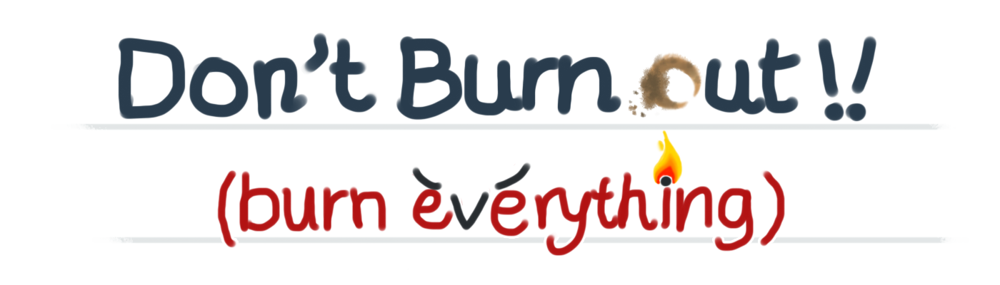
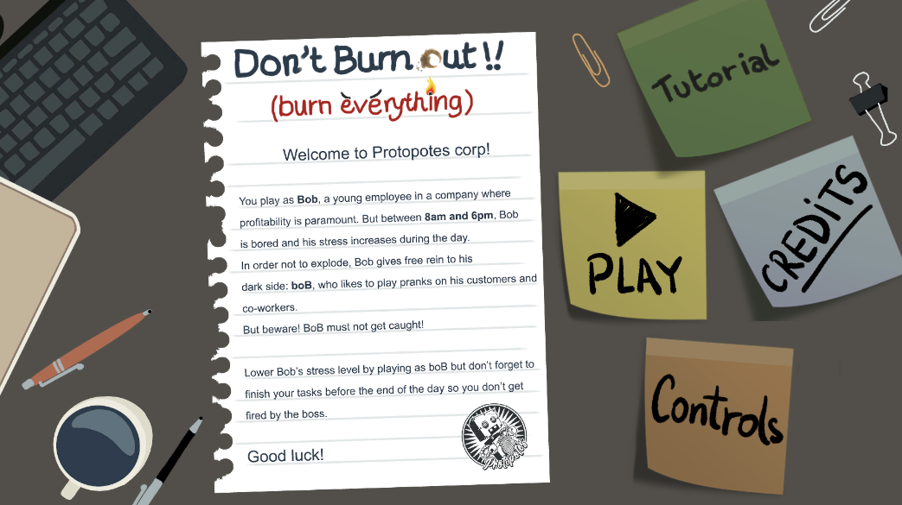
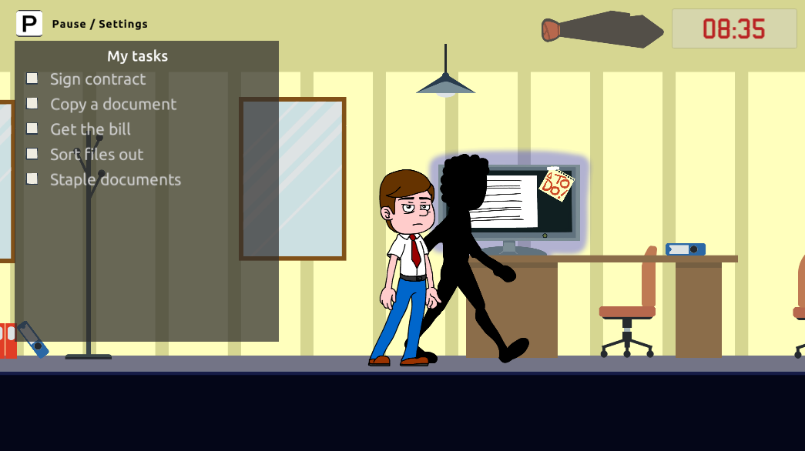
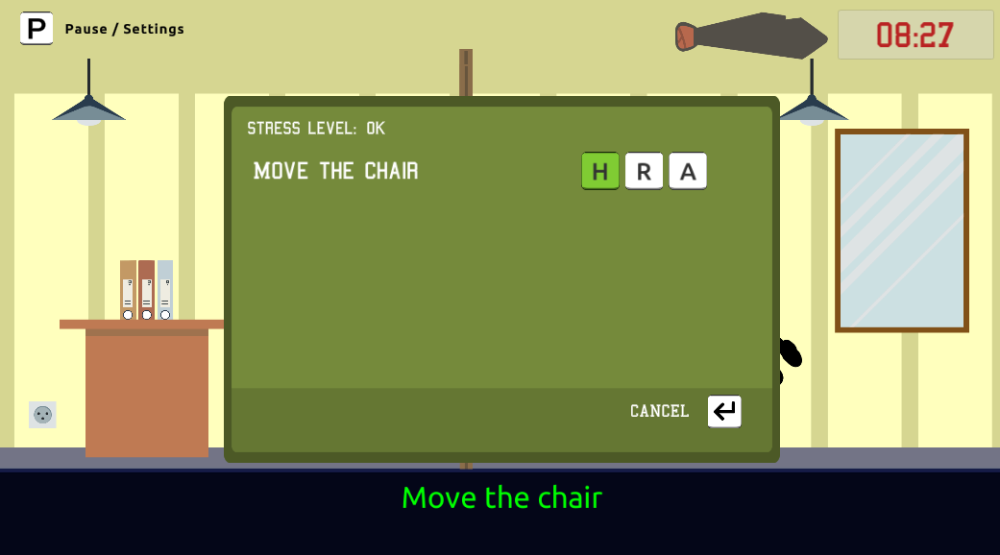
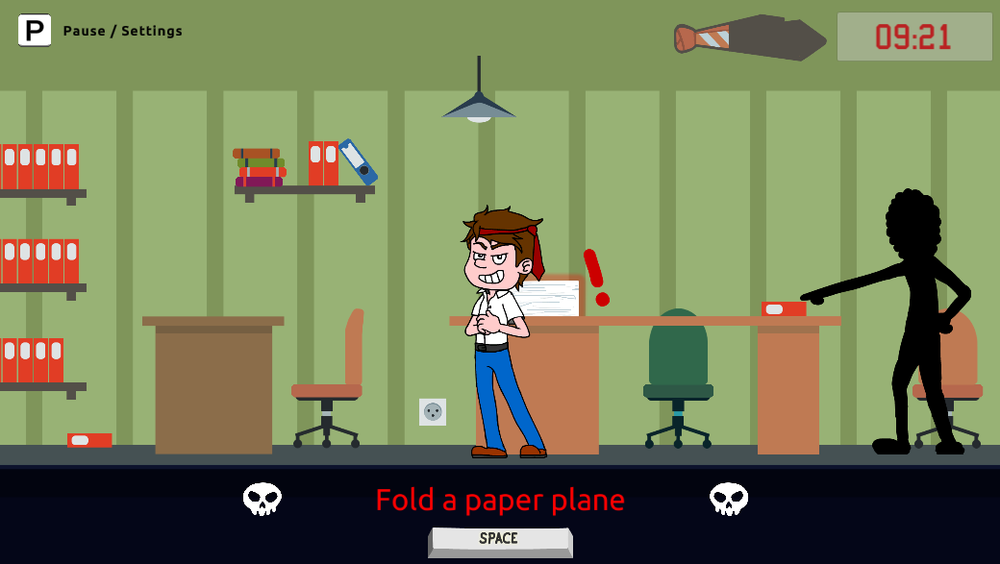
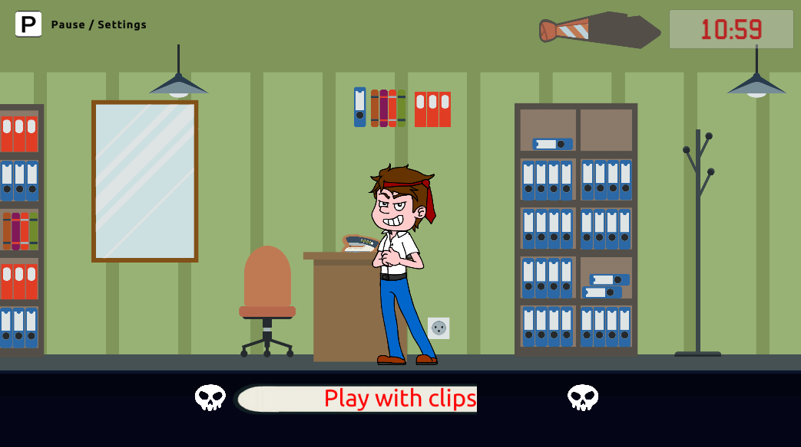

Don't burn out, burn everything !
=================================

# About

This game was developped during the Global Game Jam 2022.
This event started on the 20th of January and lasted until the 30th of January.

The game *Don't Burn Out, burn everything" was make with Unity framework.

# Speech

You play as *Bob*, a young employee in a company where profitability is paramount. But between *8am and 6pm*, Bob is bored and his stress increases during the day.

In order not to explode, Bob gives free rein to his chaotic side: *boB*, who likes to play pranks on his customers and co-workers.

But beware ! boB must not get caught!

Lower Bob's stress level by playing as boB but don't forget to finish your tasks before the end of the day so you don't get fired by the boss.

# How to play

You can launch the "Tutorial" to understand the game mechanics.
Also, It will explain its speech.

You can play on the web platform on this link "https://play.unity.com/mg/other/webgl-builds-140048".
Remember to put in full screen.

# Screenshots

# Authors

All the game mechanics, development, graphic design and sounds are homemade.
Thanks to all contributors:

* *Graphics designs*
    * PrincessPirotess (https://www.twitch.tv/princesspirotess)
    * Klaarkh (https://www.twitch.tv/klaarkh)
    * Fibertooth (https://www.twitch.tv/fibertooth)
* *Sound & Music*
    * Shakawah (https://www.twitch.tv/shakawah)
    * La Forge Des Lords (https://www.twitch.tv/laforgedeslords)
    * Woody Lutherie (https://www.twitch.tv/woodylutherie)
* *Dev*
    * Pimentofr (https://www.twitch.tv/pimentofr)
    * Klaarkh (https://www.twitch.tv/klaarkh)
    * Shakawah (https://www.twitch.tv/shakawah)
    * SombrePigeon (https://www.twitch.tv/sombrepigeon)

# Licences

The project is under license Creative Common (CC BY-NC-SA 4.0).
https://creativecommons.org/licenses/by-nc-sa/4.0/